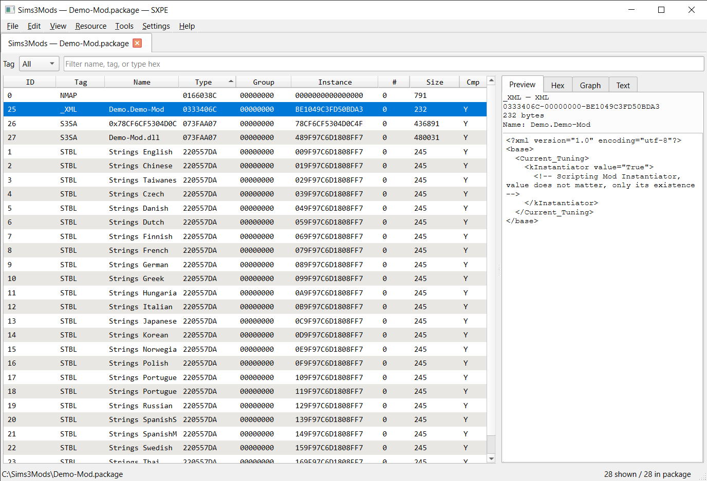

# SXPE

**SXPE** is an unofficial editor for *The Sims 3* package files. You can open a `.package` (and related `.world` / `.dbc` / `.nhd` files), look at what is inside, change it, and save - with the goal that the game can still load the result.

It is a **new program**, fully reimplemented from scratch in C++23. It is **inspired by** Peter L Jones’s s3pe, but it is **not a fork** of that code. Not Electronic Arts software. [GPL-3.0-or-later](LICENSE). The Sims 3 is a trademark of Electronic Arts.

This is an **early version**. Things may still be unfinished or buggy; that is expected while the project is in development. Features can be added, changed, or removed as people actually use the app. **Bug reports, feature requests, and general feedback** are welcome on the [GitHub Issues](https://github.com/tofb15/sxpe/issues) tab.

[](https://github.com/tofb15/sxpe/actions/workflows/ci.yml)

Current release: **[v0.7.0](https://github.com/tofb15/sxpe/releases/tag/v0.7.0)**.

---

## What SXPE is

A desktop app for everyday mod work on **Windows and Linux**, plus optional tools for people who like to script or automate:

| You want | Use |
| --- | --- |
| Click and edit, like a normal Windows program | The **SXPE** app (`SXPE.bat` on Windows) |
| Scripts or a terminal | the `sxpe` command |
| An assistant / agent that talks to SXPE | `sxpe_mcp` |



You can open a package, browse the resources inside, edit names and text, work with catalog / CAS / animation metadata, merge packages together (and split an SXPE merge back apart), check a package before you share it, compare two files, scan a Downloads folder, look inside Sims3Packs, and import or export script DLLs.

## Why it exists

Many people still use **s3pe**. It works, but it is an older Windows-only editor and is often **very slow**, especially on large packages or when combining a lot of custom content. Big merges can also run out of memory or leave huge temporary files.

SXPE is a from-scratch editor for the same kind of daily work, with a focus on **opening and browsing faster**, surviving large merges more gracefully, and running on Linux as well as Windows. The window, the command line, and automation all drive the same features.

## SXPE vs s3pe

SXPE is **not** “s3pe 2.0” and does not use s3pe’s source code. If you already know s3pe, the [user guide](docs/user-guide.md#if-you-used-s3pe-before) maps familiar menus.

| | s3pe | SXPE (today) |
| --- | --- | --- |
| Speed | Often slow on large packages | Built to open and scroll large lists more quickly |
| Computer | Windows | Windows and Linux |
| Combining many packages | Can run out of memory | Size limits, progress, and cancel instead of a mystery crash |
| Split a merge back apart | No | Yes, for packages **SXPE** merged |
| Extra editor plugins | Optional DLL “Handlers” | Not in this version |
| Neighborhood / world files | Easy to save in a way the game hates | Safer: replace in place only, for now |

Use **SXPE** if you want something snappier, Linux, or safer big merges. Stick with **s3pe** if you rely on an add-on Handler that SXPE does not have yet.

## Where the project is headed

The aim is a Sims 3 package editor you actually want to use every day: files the game can load, clear limits, and the same features in the window and in scripts. Other *Sims* games might come later; **this version is Sims 3 only**. What ships will follow feedback - nothing here is frozen forever.

## What this version does not do yet

- No Sims 4 packages.
- No spinning 3D meshes or playing animations in the preview (you still get pictures and summaries).
- No Store / DRM Sims3Pack unpacking.
- Neighborhood, world, and `.dbc` files are treated carefully so SXPE does not rebuild them into something the game will not load - see [neighborhood layout](docs/neighborhood-layout.md).
- Extra third-party editor plugins are not included right now.
- **Help → Check for update** only tells you if a newer release exists; it never downloads a zip for you.

Keep backups. Saving can rewrite a package; try changes on a **copy** first.

---

## Get SXPE

You do **not** need to compile if a download matches your computer.

| You want | Do this |
| --- | --- |
| **Windows app** | Download `sxpe-0.7.0-windows-x64.zip` from **[v0.7.0](https://github.com/tofb15/sxpe/releases/tag/v0.7.0)**. Unzip the **whole folder** somewhere you can write (leave the extra files next to the program). Double-click **`SXPE.bat`**. |
| **Linux command-line tools** | Download `sxpe-0.7.0-linux-x64-cli.tar.gz` from the same Release, extract, run `./sxpe`. |
| **Linux windowed app** | Build from source with Qt 6 ([building.md](docs/building.md)). A Linux pack can include the GUI program but still needs Qt installed on that machine. |

Drop one `.package` on the window to open it. Drop several to merge them (you can un-merge later only if SXPE did the merge).

## First steps

1. Open a **copy** of a package (never the file the game currently has open).
2. Merge a folder of CC: **Tools → Merge packages…** - [workflows](docs/workflows.md#merge-custom-content-into-one-package).
3. **Tools → Validate** before you share.

More recipes: [docs/workflows.md](docs/workflows.md). GUI reference: [docs/user-guide.md](docs/user-guide.md).

---

## Documentation

Index: **[docs/README.md](docs/README.md)**.

| Doc | Read it when |
| --- | --- |
| [User guide](docs/user-guide.md) | Using the GUI (menus, editors, shortcuts) |
| [Workflows](docs/workflows.md) | A specific mod task (merge, S3SA, scan, …) |
| [CLI & MCP](docs/cli-mcp.md) | Scripting or agents |
| [Building](docs/building.md) | Compiling, packaging, CI |
| [Format specs](docs/spec/README.md) | Codecs and the command catalog |
| [DESIGN.md](DESIGN.md) | Architecture |
| [CONTRIBUTING.md](CONTRIBUTING.md) | DCO, scope, what not to commit |

Do not commit game packages, custom content, or other copyrighted binaries.

---

## Build from source

Only if you are compiling. Releases already contain binaries.

These three CMake lines are **sequential steps**, not three ways to do the same thing:

1. **Configure** (once, or after `CMakeLists.txt` / dependency changes) - generates the build tree.
2. **Build** - compiles.
3. **Test** - optional. You can run `sxpe` / `sxpe_gui` without it.

**Windows (Visual Studio 2022/2026):** run `build.bat`. It finds MSVC, Ninja, and Qt if the kit is at `../qt/6.8.2/msvc2022_64`, then configure + build + test. `package.bat` writes a portable zip. Do not start with the CMake preset until `cl.exe` and Ninja are on `PATH` (Developer Command Prompt).

**Linux** (CMake 3.28+, Ninja, C++23 compiler):

```text
cmake --preset default                 # 1. configure → build/
cmake --build --preset default         # 2. compile
ctest --preset default --output-on-failure   # 3. optional tests
```

GUI needs Qt 6.5+ Widgets. Without Qt, CLI and MCP still build. Wayland, packaging, CI: **[docs/building.md](docs/building.md)**.

---

## Version

Project version is **0.7.0** (`CMakeLists.txt` `PROJECT_VERSION` and `vcpkg.json`). Notes: [docs/releases/v0.7.0.md](docs/releases/v0.7.0.md). Template for the next tag: [docs/releases/TEMPLATE.md](docs/releases/TEMPLATE.md).

---

## Licence

[GPL-3.0-or-later](LICENSE). Unofficial fan project. Electronic Arts owns The Sims 3. SXPE ships no EA game files. Use at your own risk; keep backups of packages you care about.
